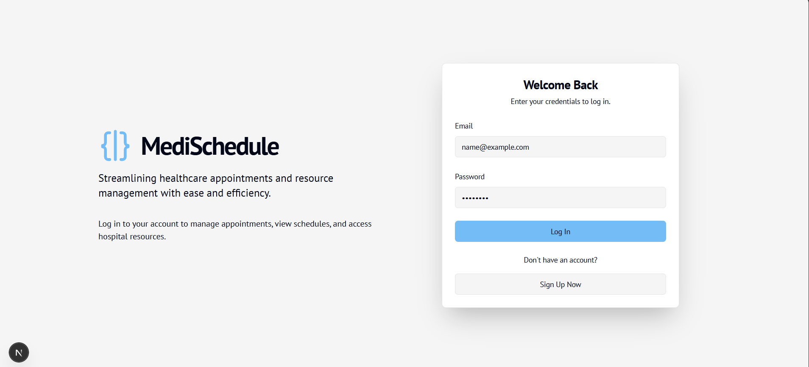
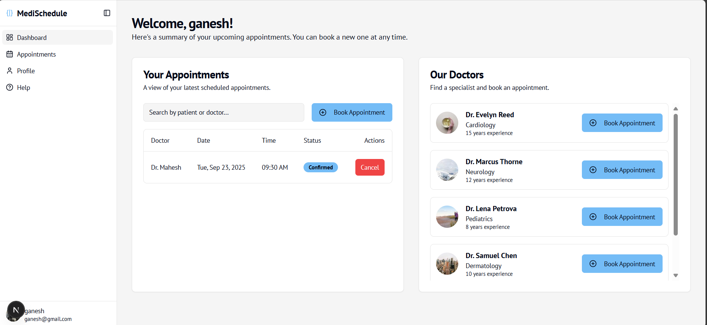
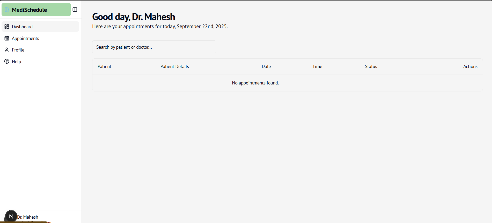
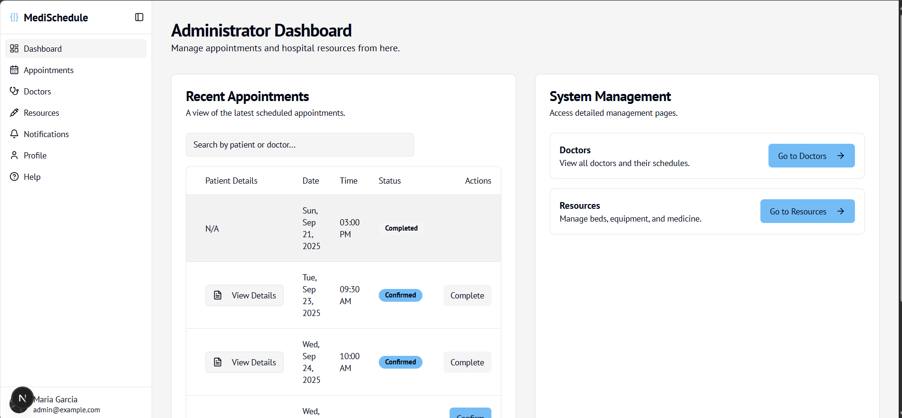

# MediSchedule: Hospital Appointment & Resource Management System (HARMS) 🏥📅

MediSchedule is a modern, all-in-one web platform designed to streamline hospital operations by simplifying appointment booking, scheduling, and resource management. It provides dedicated dashboards for patients, doctors, and administrators to ensure a seamless and efficient healthcare experience.

---

## 🚀 Built with Firebase Studio

This is a Next.js starter in Firebase Studio.
To get started, take a look at `src/app/page.tsx`.

---

## ✨ Key Features

The platform is built with three distinct user roles, each with a tailored set of features:

### 🧑‍⚕️ For Patients
-   **Easy Appointment Booking:** Search for doctors by specialty and book available slots in real-time.
-   **Personal Dashboard:** View a summary of all upcoming and past appointments.
-   **Manage Appointments:** Easily cancel or reschedule upcoming appointments.
-   **Profile Management:** Keep personal information up-to-date.

### 🩺 For Doctors
-   **Daily Schedule View:** A clean dashboard showing all appointments for the current day.
-   **Appointment Management:** Access patient details and manage the status of appointments.
-   **Personalized Profile:** Manage professional details and availability.

### ⚙️ For Administrators
-   **Centralized Dashboard:** Get a high-level overview of recent appointments, hospital statistics, and system status.
-   **Complete Appointment Oversight:** View, search, and manage all appointments across the entire system.
-   **Doctor Management:** Add new doctors and manage their schedules and profiles.
-   **Resource Management:** Track and manage hospital resources like beds, equipment, and medicine.

---

## 📸 Screenshots

### 1. Login Page
patients,doctors,admins can login through single page. According to the role the dashboards gets changes.


### 2. Patient Dashboard
Patients can view their appointments and find doctors to book new ones.


### 3. Doctor's Daily View
Doctors get a personalized view of their schedule for the day.


### 4. Administrator Dashboard
Administrators have a comprehensive overview of all hospital activities and resources.


**Note:** For the images to display correctly, you should:
1.  Create a folder named `screenshots` in your project's root directory.
2.  Rename your image files to match the names used above (`patient-dashboard.png`, `doctor-dashboard.png`, `admin-dashboard.png`) and place them inside the `screenshots` folder.

---

## 🛠️ Tech Stack (Example)

-   **Frontend:** React, Next.js, or Vue.js
-   **Styling:** Tailwind CSS or Material-UI
-   **Backend:** Node.js with Express.js 
-   **Database:** PostgreSQL 

---

## 🚀 Getting Started

To get a local copy up and running, follow these simple steps.

### Prerequisites
-   Node.js (v18 or later)
-   npm or yarn

### Installation
1.  **Clone the repository:**
    ```bash
    git clone [https://github.com/Ganeshkaithoju/medischedule.git](https://github.com/Ganeshkaithoju/medischedule.git)
    ```
2.  **Navigate to the project directory:**
    ```bash
    cd medischedule
    ```
3.  **Install dependencies:**
    ```bash
    npm install
    ```
4.  **Run the development server:**
    ```bash
    npm run dev
    ```
    Open [http://localhost:3000](http://localhost:3000) with your browser to see the result.

---

## 🤝 Contributing

Contributions are what make the open-source community such an amazing place to learn, inspire, and create. Any contributions you make are **greatly appreciated**.

If you have a suggestion that would make this better, please fork the repo and create a pull request. You can also simply open an issue with the tag "enhancement".

1.  Fork the Project
2.  Create your Feature Branch (`git checkout -b feature/AmazingFeature`)
3.  Commit your Changes (`git commit -m 'Add some AmazingFeature'`)
4.  Push to the Branch (`git push origin feature/AmazingFeature`)
5.  Open a Pull Request

---

## 📄 License

Distributed under the MIT License. See `LICENSE` file for more information.